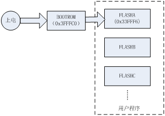
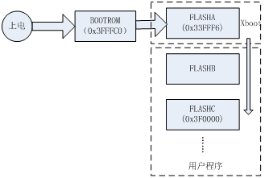
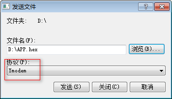
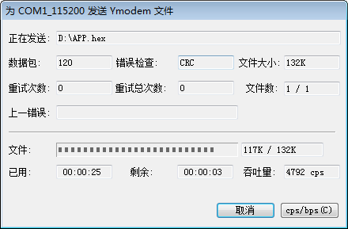
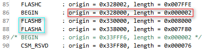
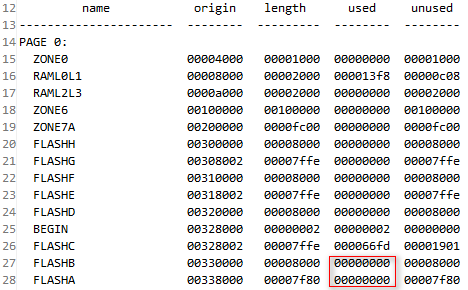
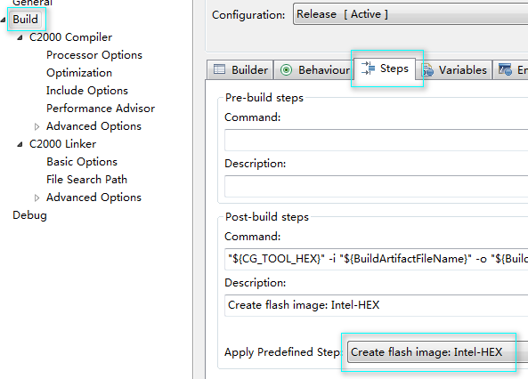
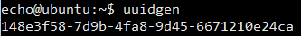
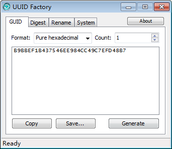

## 特性介绍

XBOOT是一款TI C2000平台的bootloader软件，配合USBTTL，USBCAN等硬件，可以实现
C2000系列DSP固件IAP功能。

XBOOT分为基础版本和定制版本，基础版本免费，用于评估，无技术支持，定制版本
可用于商业场合，提供有限的技术支持。

### 基础版本特性

- 支持TMS320F28335/TMS320F28069/TMS320F28035。
- 28335使用30M外部晶振，28069/28035使用内部10M晶振。
- 支持1个CAN，28335支持3个UART，28069支持2个UART，28035支持1个UART，通讯GPIO固定。
- CAN接口波特率固定500kbps。
- 串口波特率固定115200bps。
- 无固件加密功能。
- 只支持1个用户程序，入口地址固定。
- 支持用户固件更新。

### 定制版本特性

- 支持C2000系列所有芯片（极少数FLASH过小的芯片除外）。
- 外部晶振频率可选。
- 支持一个CAN接口，3个TTL串口或者485接口，用于通讯的GPIO可选。
- CAN接口波特率可定值，默认500kbps。
- 串口波特率可定制，默认115200bps。
- 可自带固件加密功能，确保用户固件安全。
- 可读取FLASH、SRAM、外设内容。
- 支持最多6个用户程序。可以设置上电后自动运行的用户程序。
- 支持用户固件更新。
- 可访问内置模拟EEPROM。
- 可设置器件全球唯一ID，用于产品序列号，固件加密等场合。

### 硬件资源占用

- FLASH：FLASHA和FLASHB
- 定时器：CpuTimer0
- 通信接口
  1. SCIA (GPIO28/GPIO29)(28335/28069/28035)
  2. SCIB (GPIO22/GPIO23)(28335/28069)
  3. SCIC (GPIO62/GPIO63)(28335)
  4. ECANA (GPIO30/GPIO31)(28335/28069/28035)
- 由于跳转用户程序以后XBOOT不再运行，因此SRAM与用户程序无冲突。

## 工作原理

### C2000上电引导过程

C2000系列DSP上电以后从内部BOOTROM引导，上电复位以后DSP跳转到0x3FFFC0执行内部
BOOTROM中的代码，根据特定GPIO状态，判断引导模式，一般均使用FLASH引导模式，
即BOOTROM中代码执行完毕之后将控制权交给FLASH中的代码。

整个过程如下图所示：
 


### XBOOT工作原理

C2000内置BOOTROM通过GPIO来判断引导模式，单板设计时需要设计引导跳线，每次更新程序
要插拔跳线，使用不便。同时内部BOOTROM中的代码只能执行简单的代码更新功能。
 


实际中C2000系列DSP的FLASH空间往往十分充足，将FLASH按照扇区(sector)划分为几部分，
FLASHA包含了BOOTROM的跳转地址0x33FFF6，用来存放XBOOT程序；FLASHB用来模拟内置EEPROM；
剩下的所有FLASH存放用户程序。

上电以后，FLASHA中的XBOOT代码首先执行，根据串口或者CAN接口数据流判断进入用户程序
还是XBOOT shell，如果0.5秒内某个串口上连续收到5个字母’e’，进入XBOOT shell，
否则进入用户程序。该设计会带来上电0.5秒的上电延时，一般情况下可以接受，带来的好处
是硬件设计无需额外的跳线。XBOOT shell中可以执行用户固件IAP更新功能。

## 使用方法

### 进入XBOOT shell方法

XBOOT上电启动以后在0.5秒内检测串口输入，如果收到连续5个字母“e”，便进入XBOOT shell；
否则访问模拟EEPROM获取用户程序入口点，如果用户程序有效，执行用户程序，否则进入XBOOT shell。

使用超级终端连接串口，`波特率115200，8位数据，1位停止，无校验，无流控`。按住键盘上
的字母“e”，点击控制板上的复位按键，或者给控制板重新上电。可以进入XBOOT shell。

CAN接口借助UARTCAN或者USBCAN硬件，设置工作模式为桥接模式，其余使用方法与串口完全相同。

超级终端为Windows XP自带程序，通过`开始->所有程序->附件->通讯->超级终端`打开。
Windows7系统不带超级终端，可以将Windows XP系统的超级终端软件拷贝过去直接使用。

### 更新用户软件详细步骤

首先连接XBOOT shell，使用empty命令查看要写入的FLASH是否为空，如果不为空，使用
`erase x`命令擦除软件所在FLASH，其中x为FLASH名字，取值`a、b、c…`.

使用ymodem命令更新用户软件。

**注意**：erase a命令将擦除包括XBOOT在内所有FLASH内容，也包括加密密码，擦除所有
FLASH内容以后掉电之前，XBOOT仍然可以运行并且更新程序，如果擦除以后掉电，只能使用
仿真器将XBOOT写入DSP。将用户代码写入未擦除的FLASH运行结果将是不确定的。

## 基础命令

本节对基础版XBOOT提供的命令进行描述。

### empty

FLASH查空命令，无参数，用来检测用户FLASH是否为空。

``` 
empty
 FLASHA is NOT empty @ 0x338000.
 FLASHB is NOT empty @ 0x330000.
 FLASHC is NOT empty @ 0x328000.
 FLASHD is empty @ 0x320000.
 FLASHE is empty @ 0x318000.
 FLASHF is empty @ 0x310000.
 FLASHG is empty @ 0x308000.
 FLASHH is empty @ 0x300000.
```

**注意**：C2000系列DSP的FLASH最小擦除单位是一个扇区，写入之前必须确保为空，否则需要先进行擦除。

### erase 

FLASH擦除命令。
erase命令接受一个字符串参数：abcdefgh，分别对应8个FLASH扇区。可以同时指定
多个FLASH扇区，如`erase bcd`命令将会擦除b c d三个flash扇区。

**注意**：erase a命令将擦除包括XBOOT在内所有FLASH内容，也包括加密密码，擦除所有
FLASH内容以后掉电之前，XBOOT仍然可以运行并且更新程序，如果擦除以后掉电，只能使用
仿真器将XBOOT写入DSP。将用户代码写入未擦除的FLASH运行结果将是不确定的。
 
```
empty
 FLASHA is NOT empty @ 0x338000.
 FLASHB is NOT empty @ 0x330000.
 FLASHC is NOT empty @ 0x328000.
 FLASHD is empty @ 0x320000.
 FLASHE is empty @ 0x318000.
 FLASHF is empty @ 0x310000.
 FLASHG is empty @ 0x308000.
 FLASHH is empty @ 0x300000.
erase c
 erase flash sector 0x04 OK.
empty
 FLASHA is NOT empty @ 0x338000.
 FLASHB is NOT empty @ 0x330000.
 FLASHC is empty @ 0x328000.
 FLASHD is empty @ 0x320000.
 FLASHE is empty @ 0x318000.
 FLASHF is empty @ 0x310000.
 FLASHG is empty @ 0x308000.
 FLASHH is empty @ 0x300000.
```

### reboot

重启系统。带一个延时参数，单位ms。执行reboot 1000即延时1秒以后重新启动，
无参数默认10ms延时以后重新启动。

```
reboot
 rebooting ...
reboot 500
 rebooting ...
```


### ymodem

使用ymodem协议更新用户软件。

执行ymodem命令，超级终端显示字符`C`以后，选择菜单`发送->发送文件`，文件名选择
用户程序的hex文件，协议选择Ymodem，点击发送即可。
 

 


```
ymodem
 warning: flash address 0x330000 is not empty, do not use it.
 ymodem update firmware, press A to abort ...
 CCCCCCC
  Update firmware OK!
  File Name: APP.hex
  File Size: 148517
  End Addr:  0x32F874
```

执行ymodem命令以后，超级终端显示C时，可以按字母a取消命令。

用户发送的APP固件，**不能使用FLASHA或者FLASHB**，否则将会损坏XBOOT固件。

### help 

显示XBOOT帮助信息。

```
help
 empty -> empty Check flash sector is empty or not.
 erase -> erase [abcdefgh] Erase flash sector.
 entry -> entry [hex addr] Get/Set user app entry.
 memrd -> memrd [hex addr] [hex len] Show Memory.
 goto -> goto [hex addr] to execute.
 eeprom -> eeprom [load|save|read|write] [addr] [data] Operate Int. EEPROM.
 uuid -> uuid [128bits hex string] Show/Setup UUID.
 reboot -> reboot [delay ms] Restart xboot.
 ymodem -> update user APPs.
 help -> help Info.
 version -> version display bootloader Info.
```

**注意**：基础版本不支持entry、memrd、goto、eeprom、uuid命令。

### version

显示XBOOT版本和版权信息。
 
```
version
 xboot v18.03.17 SN: 6D53150634C24E7C907C685707910F63
 for TMS320F28335 by ECHO Studio <echo.xjtu@gmail.com>.
 All Rights Reserved.
```

**注意**：没有写入唯一ID的DSP芯片，序列号SN内容为全FF。

## 高级命令

定制版XBOOT可以支持高级功能，通过本节提供的高级命令进行支持。

### entry

设置、查看用户程序入口点。

默认无参数查看当前用户程序入口点，带一个参数为设置用户程序入口点。
 
```
entry
 user app entry is 0x328000.
entry 320000
 set user app entry to 0x320000 .
entry
 user app entry is 0x320000.
```

### memrd 

读取DSP内存。内存地址包括SRAM、FLASH、地址。

memrd命令接受两个参数，第一个为要读取的内存地址，第二个为要读取的数据长度，
默认128。全部为十六进制。
 
```
memrd 328000

0x328000 0072 E301 761F 030D E801 D418 E2C4 0106
0x328008 E808 9378 E700 0040 7700 E68A 0000 7700
0x328010 761F 0305 BFA9 0F12 0F22 6905 0201 5601
0x328018 0022 6F09 761F 0312 0200 1A07 1000 761F
0x328020 0305 1E22 761F 030D E801 E118 E2C4 0106
0x328028 E80E B850 E700 0040 7700 E68A 0000 7700
0x328030 761F 0305 BFA9 0F12 0F24 6905 0201 5601
0x328038 0024 6F0D 761F 0312 1A07 0010 0200 1A07
0x328040 0080 1A07 0020 761F 0305 1E24 761F 030D
0x328048 E2C4 0006 7700 E68A 0000 7700 761F 0305
0x328050 BFA9 0F12 0F26 6905 0201 5601 0026 6F0B
0x328058 761F 0312 0200 1A07 0040 1A07 0800 761F
0x328060 0305 1E26 761F 030D E801 F260 E2C4 0106
0x328068 E80E 6668 E700 0040 7700 E68A 0000 7700
0x328070 761F 0305 BFA9 0F12 0F28 660A 8F00 C480
0x328078 44F4 6C03 1AFC 2000 0200 1E28 0006 0201
```

### goto

跳转到新地址执行。
接受一个复位向量作为参数。28335平台下goto 33fff6将会重启XBOOT，如图 11。
 
```
goto 33FFF6
 goto address 0x33FFF6 to execute...
```

### eeprom

读写DSP内部模拟EEPROM。带四个子命令：`read、write、load、save`。

- 读eeprom：eeprom read [地址] [长度]，其中地址为必要参数，长度可不填，默认128字，从内部缓存读取数据。
- 写eeprom：eeprom write [地址] [数据]，其中地址和数据均为必要参数，数据写入内部缓存。
- 加载eeprom：eeprom load，数据从FLASH加载到内部缓存。
- 存储eeprom：eeprom save，eeprom数据从内部缓存写入FLASH，掉电保存。

内置模拟eeprom总共255个16位字，前16个字预留给XBOOT自身使用，其余用户程序可用。
 
```
eeprom read 0

0x0000  8000 0032 FFFD 01F4 FFFF FFFF FFFF FFFF
0x0008  FFFF FFFF FFFF FFFF FFFF FFFF FFFF FFFF
0x0010  0003 0001 0028 FFFF 00F3 FFFF 0009 FFFF
0x0018  FFFF FFFF FFFF FFFF FFFF FFFF FFFF FFFF
0x0020  0002 0001 0028 FFFF 00F3 FFFF 0009 FFFF
0x0028  FFFF FFFF FFFF FFFF FFFF FFFF FFFF FFFF
0x0030  FFFF FFFF FFFF FFFF FFFF FFFF FFFF FFFF
0x0038  FFFF FFFF FFFF FFFF FFFF FFFF FFFF FFFF
0x0040  0002 0001 0028 FFFF 00F3 FFFF 0009 FFFF
0x0048  FFFF FFFF FFFF FFFF FFFF FFFF FFFF FFFF
0x0050  FFFF FFFF FFFF FFFF FFFF FFFF FFFF FFFF
0x0058  FFFF FFFF FFFF FFFF FFFF FFFF FFFF FFFF
0x0060  FFFF FFFF FFFF FFFF FFFF FFFF FFFF FFFF
0x0068  FFFF FFFF FFFF FFFF FFFF FFFF FFFF FFFF
0x0070  FFFF FFFF FFFF FFFF FFFF FFFF FFFF FFFF
0x0078  FFFF FFFF FFFF FFFF FFFF FFFF FFFF FFFF
```

### uuid

查看或者设置芯片的唯一ID。芯片的唯一ID可以用作芯片序列号、单板序列号、设备序列号。
还可以用来加密固件。许多现代MCU如STM8、STM32、STC本身提供了唯一ID，TI C2000系列
MCU没有提供唯一ID，XBOOT利用OTP存储空间来实现唯一ID功能。

不带参数的uuid命令可以显示当前DSP的uuid，如下所示： 

```
uuid
BBF2CE53C8B54062B42C3E8423AD9E88
```

如果单板没有设置uuid，uuid命令无输出。未写入uuid的单板，可以使用uuid命令写入uuid，
如下所示：

```
uuid BBF2CE53C8B54062B42C3E8423AD9E88
```

**注意**：一块单板uuid只能写入一次，要保证写入的uuid**每次都是重新生成的**，避免重复。
uuid写入以后，重新擦写FLASH均不受影响，更换uuid的唯一方法是更换新的芯片。

## 用户软件编写指南

### 复位向量

TMS320F28335 FLASH入口地址为0x33FFF6，这个地址位于FLASHA，已经被XBOOT占用。
用户代码需要使用另外的复位向量。XBOOT默认会将入口地址设置到FLASHC开头两个字，
地址0x328000，上电后XBOOT可以跳转到FLASHC执行用户代码。

用户代码需要将复位向量放到所在FLASH扇区开始两个字。所有用户代码放在FLASHC，复位
向量占用FLASHC开始两个字。
 


定制版XBOOT固件可以使用entry命令重新设置复位向量，实现多APP支持。
由于XBOOT本身使用FLASHA和FLASHB，用户程序不能占用这两处FLASH，编写cmd文件时需要注意，
用户程序编译后注意检查map文件，确认两块FLASH没有使用。
 


### 生成hex文件

使用hex2000命令行工具将CCS编译生成的.out文件转化为hex文件。命令如下：

```
hex2000 --intel -romwidth 16 -memwidth 16 TEST.out
```

其中TEST.out为需要转化的.out文件，根据实际需要进行替换。.hex文件实际为文本文件，
可以使用文本编辑器打开查看。

CCS5可以设置编译完成自动输出hex文件，设置方法如下：

在工程名上按Alt+Enter打开项目属性设置页，然后按照下图设置即可。
 


## uuid生成指南

UUID含义是通用唯一识别码 (Universally Unique Identifier)，是指在一台机器上生成的
数字，它保证对在同一时空中的所有机器都是唯一的。通常使用一个16进制字符串表示，
如：`BBF2CE53C8B54062B42C3E8423AD9E88`。

### Linux

Linux平台下可以使用uuidgen命令生成uuid，注意输入时去掉中间的’-’分隔符。
 


### Windows

Windows平台下可以使用PDFFactory软件来生成uuid.
 


## 免责条款

### 基础版

使用方法请参考本文档，作者不提供任何技术支持与保证。

### 定制版

可用于商业场合。使用方法请参考本文档，同时作者会尽力满足客户需求，并提供有限的技术支持。
技术支持仅仅限于XBOOT固件本身，用户需要对最终产品测试负责，作者不提供用户产品的
技术支持与保证。用户使用XBOOT默认接受以上条款。
